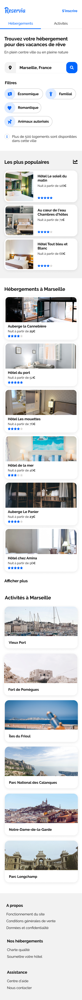

 

<h1 align="center">projet 2</h1>
 

## Introduction - Quezaco ?

"Reservia" est le deuxième projet que je réalise dans le cadre de ma formation avec  **OpenClassrooms**.

Dans ce scénario, je suis stagiaire dans une entreprise qui propose un outil de planification de vacances.

Mon travail consiste à intégrer la maquette graphique en utilisant uniquement *HTML* et *CSS*, mais avant toute chose, voyons en quoi il consiste.

***************
## Présentation - Les maquettes
Pour mener à bien ce projet, Nous sommes partis sur deux maquettes :
1. Une version "**Desktop**" pour un affichage sur des écrans à partir de *1440px*

1. Une version "**Mobile**" pour un affichage sur les écrans de smartphone de *375px* comme l'iPhone 8.

